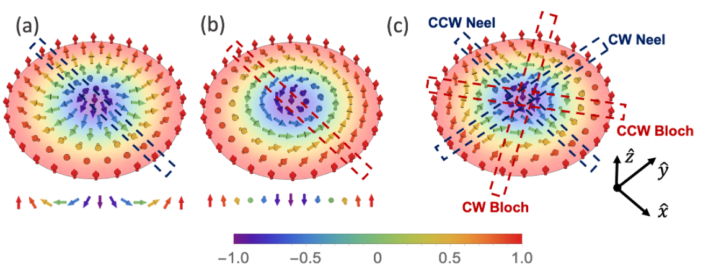

 # Topological Hall Effect (THE) in a Skyrmion crystal (SkX)

- This repository contains the codes used in my MSc thesis and further explorations made in the process. 

- My Thesis and Presentation are included here, Feel free to explore.
- Unless mentioned credits explicitly in the thesis or presentation citing an image, otherwise the image is generated by my with inspirations from literature.
- Mostly the codes are for calculating the Berry Phase and Berry curvature to calculate the Quantum Topological Hall effect in Skyrmion crystals.
- Squre SkX, Triangular lattice SkX, Honeycomb lattice SkX were studied.

 ## What is a skyrmion ?

 

  A magnetic skyrmion is a small swirling pattern in the magnetization texture (aka spin texture). In pioneering literature they have been refered to as magnetic vortices or vortex like configurations. It is a type of highly metastable soliton or a defect. This concept is an analog adopted from the nuclear physics idea proposed by the British nuclear physicist Tony Skyrme. He proposed this idea in 1960's for the theoretical treatment of interactions between the fundamental particles like the poins. Then this idea evolved and the skyrmion is understood as a particle like excitation in its corresponding field. In condensed matter systems, this field is the array of magnetic moments. The key feature that differentiates a magnetic skyrmion from anyother type of magnetic solitons like the magnetic bubbles, merons etc., is that the centre magnetic moment and the moments on the outer edges of a skyrmions are pointed opposite to each other and parallel to the normal direction of the plane of their existance.

  
   
  <em>Figure 1: Anatomy of Skyrmions andWinding numbers. (a) Neel type skyrmion. Cross section
along any radial direction is a CCW Neel domain wall. (b) Bloch skyrmion. Cross section along
any direction is a CCW Neel domain wall. (c) Anti-skyrmion, showing different domain wall type cross sections along different radial directions. Alternates between Neel and Bloch walls with CW and CCW rotation of
spins, depending on the skyrmions.</em>

